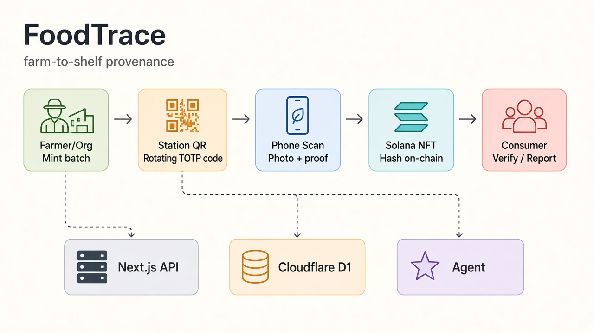

# FoodTrace

Farm-to-shelf provenance on Solana. Each batch is a Metaplex Core NFT; each stage writes a photo hash on-chain. Stations show a rotating TOTP QR so a scan proves presence.



**Live:** [foodtrace.oliverchou.dev](https://foodtrace.oliverchou.dev)

## Demo

1. `/` — mint a batch NFT → product QR
2. `/station/1`…`/4` — display rotating station QR (1.5 min)
3. `/scan` — scan station + product, take photo, submit
4. `/verify/<id>` — check photo hashes vs on-chain (tamper flips badge)

## Stack

Next.js · Solana (Metaplex Core) · Cloudflare D1 + R2 · IFM K2 Horizon (AI reports) · OpenRouter (photo validation)

## Run

```bash
pnpm install
# .env.local from env.example (Solana + Cloudflare D1 + IFM + OpenRouter)
solana-keygen pubkey .keys/server.json   # fund via faucet
pnpm db:migrate
pnpm dev
```

iPhone camera needs HTTPS: `pnpm dev` starts ngrok + Next and prints a public URL. Open that URL in Safari.

## Deploy

Pushes to `main` run lint → test → `pnpm run deploy`.

Secrets: `CLOUDFLARE_API_TOKEN`, `CLOUDFLARE_ACCOUNT_ID` (GitHub Actions). Worker secrets via `pnpm secrets:put` (reads `.env.local`).

**Solana RPC:** public `api.devnet.solana.com` returns `403` from Cloudflare Workers. The app defaults to MagicBlock’s keyless devnet RPC (`https://rpc.magicblock.app/devnet`), which works from Workers. Override with Helius/QuickNode via `SOLANA_RPC_URL` in `.env.local` if you need higher limits, then `pnpm secrets:put`.

```bash
NEXT_PUBLIC_BASE_URL=https://foodtrace.oliverchou.dev pnpm run deploy
pnpm secrets:put   # includes SOLANA_RPC_URL, SERVER_KEYPAIR_JSON, D1/R2, IFM, …
```

## Layout

| Path | Role |
| --- | --- |
| `src/lib/totp.ts` | rotating station code |
| `src/lib/solana.ts` | mint / append / read NFT |
| `src/lib/db.ts` | D1 batches & stages |
| `src/lib/r2.ts` | stage photo storage |
| `src/app/api/*` | HTTP API |
| `src/app/{page,scan,station,verify}` | UI |

```bash
pnpm test
```
